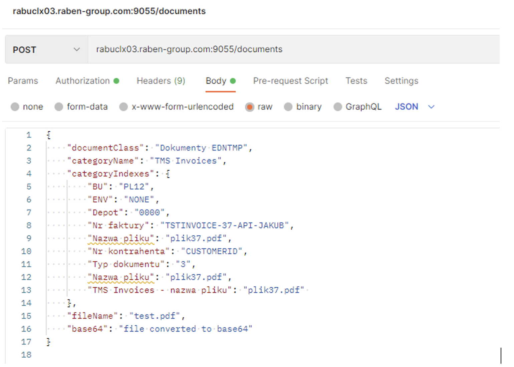

#### This software was written during my internship at Raben and belongs to Raben Logistics Polska sp. z o.o.

**1. Interfejs TMS <> CD3 zakres**
- Narzędzie do przesyłania plików do systemu Contman. 
- Struktura podzielona na dwie części: 
    - monitor przeszukujący wybrane katalogi w celu przesłania plików do API, 
    - web service odbierający pliki i przesyłający do systemu Contman. 
- Ustawienia przesyłania plików możliwe są do konfiguracji poprzez settings.json.

**2. Jak wygląda komunikacja** 
Rozwiązaniem jest podział systemu na dwie części: 
- Pierwsza z nich monitoruje pliki w poszczególnych katalogach i przy wykorzystaniu podanych ustawień w pliku konfiguracyjnym (settings.json) wysyłany jest plik w formacie base64 na endpoint web service’u. 
- Drugą częścią systemu jest sam web service, na którym stworzone endpointy odbierają POST requesty od monitora lub innego użytkownika, po czym system komunikuje się z REST API Contman’a przesyłając pliki z potrzebnymi atrybutami. Możliwe jest również wysyłanie zapytań bezpośrednio do API.

**3. Technologie**
Dla przejrzystości oraz łatwości interakcji z kodem interfejs opiera się na dwóch stworzonych kontenerach korzystając z Docker i Docker Compose. Po jednym dla monitora oraz web service’u. Web service napisany w Pythonie wykorzystuje bibliotekę Flask, pomagającą w utworzeniu endpointów API do komunikacji pomiędzy aplikacjami.

**4. Jak web service komunikuje się z API Contmana**

Wysyłanie pliku do systemu Contman podzielone jest na 7 części. Każda z nich jest POST requestem na odpowiedni adres.
- Logowanie:
    - Post request zwracający token oraz cookies
- Konwertowanie formatu zapytania oraz pobieranie informacji o klasie dokumentu i indeksach:
    - API Contmana oferuje również sprawdzenie requestem, czy dana klasa dokumentu instnieje oraz czy wprowadzone indeksy faktycznie należą do podanej kategorii.
- Rozpoczynanie transakcji:
    - Po otrzymaniu tokenu oraz cookies, zamieszamy je w headerze requestu z pustym body. 
    - Od tego momentu token i cookies znajduje się w każdym headerze requestu.
- Tworzenie dokumentu:
    - Link requesta musi zawierać nazwę klasy dokumentu.
    - Body jest przekazywane w poniższym formacie i konwersja danych następuje poprzez skrypt.
    
    - Request zwraca ID dokumentu, które będzie wykorzystywane do przesłania pliku do tego dokumentu.
- Wysyłanie pliku do dokumentu:
    - Format multipart/form-data, zawierający binarną wersje pliku.
    - W adresie do requestu zamieszcone musi być ID dokumentu.
- Kończenie transakcji:
    - Pusty post request na odpowiedni adres API, headers powtarzane.
- Wyglowanie:
    - Pusty post request na odpowiedni adres API, headers powtarzane.

**5. Gdzie znajduje się projekt**

Serwer: rabuclx03
Foldery:
- Test: /docker-projects/test/tms-cd3-interface
- Prod: /docker-projects/prod/tms-cd3-interface
Wszystkie nazwy folderów w dokumentacji znajdują się pod tymi ścieżkami w zależności od środowiska.

**6. Wykorzystanie Web service’u** 
Stworzone REST API w Pythonie przy pomocy biblioteki Flask, zapakowane w kontener Docker, umożliwiające przesyłanie danych między monitorem lub innym źródłem, a ostatecznym umieszczeniem pliku w Contmanie.

**Adres serwera web service’u**

**Użytkowanie API - Obsługiwany format zapytania JSON:**

Potrzebne dane: 
- klasa dokumentu,
- nazwa kategorii, 
- atrybuty/indeksy kategorii,
- plik w formacie base64,
- nazwa pliku - ”fileName”, czyli pełna nazwa pliku, pod którą ma być zapisany plik w Contmanie

Poniższy przykład stworzony został na podstawie kategorii TMS Invoices.

**Odpowiednik formatu JSON w systemie Contman wygląda następująco:**

 
1.	Klasa systemu
2.	Nazwa kategorii
3.	Nazwy indeksów/atrybutów
4.	Dane indeksów/atrybutów do wypełnienia

Kolejność wprowadzanych danych nie ma znaczenia.

**Przykładowy request w Postmanie**

Na wyżej wymieniony adres serwera z dodanym endpointem /documents wysyłamy zapytanie POST z formatem JSON podanym również w poprzednim punkcie. W zakładce body wybieramy raw, a następnie z rozwijanej listy JSON.

~~~~
{
    "documentClass": "Dokumenty",
    "categoryName": "Invoices",
    "categoryIndexes": {
        "BU": "PL12",
        "ENV": "NONE",
        "Depot": "0000",
        "Nr faktury": "TSTINVOICE-37-API-JAKUB",
        "Nazwa pliku": "plik37.pdf",
        "Nr kontrahenta": "CUSTOMERID",
        "Typ dokumentu": "3",
        "Nazwa pliku": "plik37.pdf",
        "TMS Invoices - nazwa pliku": "plik37.pdf" 
    },
    "fileName": "test.pdf",
    "base64": "file converted to base64"
}
~~~~
**Odpowiedzi REST API**

- błędna odpowiedź może oznaczać, że:
    - klasa dokumentu nie istnieje – kod 400,
    - atrybut/indeks kategorii nie istnieje – kod 400,
    - plik konfiguracyjny monitora jest źle uzupełniony – kod 400,
    - wewnętrzny błąd interfejsu – kod 500.

Nazwy te sprawdzane są poprzez dostępne GET requesty API Contmana, które zwracają interfejsowi wszystkie możliwe indeksy/atrybuty kategorii oraz klasę dokumentu wprowadzonych danych. 

W przypadku gdy nastąpi błąd po stronie systemu np. timeout ze strony Contmana lub błąd wywoływanej funkcji, zwracany jest błąd nawiązujący do funkcji, w której wystąpił błąd. 

- prawidłowa odpowiedź:

    - potwierdzenie wysłania pliku i archiwizacji w systemie Contman oraz czas trwania  requestu – kod 201
	
**Logowanie błędów API**
W folderze projektu wchodzimy w katolog app następnie api_logs. Każdy plik w tym katalogu nazwany jest datą i zawiera logi z całego dnia.

Wartości oddzielone są znakami „|” oraz w kolejności informują o:
1.	Godzina wystąpienia operacji
2.	Typ wiadomości INFO lub ERROR
3.	Jaka operacja jest wykonywana
4.	ID błędu/potwierdzenia
5.	Miejsca gdzie błąd wystąpił lub potwierdzenie udanej operacji
6.	Informacja o błędzie

**7. Monitor plików**
Monitor przeszukuje pliki znajdujące się w katalogu wybranym przez użytkownika, parsując ich nazwę i wrzucając do api Contmana, z wszystkimi informacjami. Skrypt ten wysyła najpierw post requesta do web service’u i zwraca do pliku z logami informacje o kodzie odpowiedzi lub ewentualnych błędach. Monitor jest w pełni konfigurowalny i zależy od pliku settings.json. 

####Jak wygląda settings.json, czyli konfiguracja ustawień monitora

~~~~
{
    "array": [
        {
            "path": "/chfakt2/kl2014/cd3/tslay2/de_test/out/",
            "files": [
                {
                    "extension": "pdf",
                    "documentClass": "Dokumenty EDNTMP",
                    "categoryName": "TMS Invoices",
                    "indexes": ["BU", "ENV", "Depot", "Nr kontrahenta", "Nr faktury", "Typ dokumentu", "Nazwa pliku"],
                    "separator": "_",
                    "wholeFileName": "TMS Invoices - nazwa pliku",
                    "delete": true
                }
            ]
        },
        {
            "path": "/chfakt2/kl2014/cd3/tslay2/nl_test/out/",
            "files": [
                {
                    "extension": "pdf",
                    "documentClass": "Dokumenty EDNTMP",
                    "categoryName": "TMS Invoices",
                    "indexes": ["BU", "ENV", "Depot", "Nr kontrahenta", "Nr faktury", "Typ dokumentu", "Nazwa pliku"],
                    "separator": "_",
                    "wholeFileName": "TMS Invoices - nazwa pliku",
                    "delete": true
                }
            ]
        }
    ]
}
~~~~

**Zasobem, z którego monitor przeszukuje pliki jest zamontowany w kontenerze folder chfakt2**

Do zarządzania monitorem, wykorzystywany jest plik settings.json. Znajduje się on pod ścieżką /app/monitor/config/settings.json. Główna tablica **array** zawiera w formacie JSON obiekty, zawierające informacje o przeszukiwaniu folderu podanego pod kluczem **path**. Do każdego folderu możemy dodać ustawienia do kilku rodzajów plików bazujące na rozszerzeniu pliku.

Zaczynamy od klasy dokumentów, do której mają trafić pliki o danym rozszerzeniu z wybranego folderu uzupełniając pole **”documentClass”**.

Następną informacją jest nazwa kategorii, gdzie pliki mają trafić. Należy uzupełnić pole **”categoryName”** odpowiednią nazwą.

Aby pliki zostały dodane do systemu Contman, musimy również podać kolejność indeksów z nazwy pliku np.

Nazwa powyższego pliku posiada informacje po kolei dotyczące: **BU, ENV, Depot, Nr kontrahenta, Nr faktury, Typ dokumentu, Nazwa pliku**. Użytkownik korzystający z interfejsu, musi znać jakie indeksy są do uzupełnienia w odpowiedniej kategorii.

W takim wypadku, nazwy tych indeksów trzeba wprowadzić w pole **”indexes”** w postaci tablicy czyli **[”BU”, ”ENV”, ”Depot”, ”Nr kontrahenta”, ”Nr faktury”, ”Typ dokumentu”, ”Nazwa pliku”]**.

Następnym polem w kolejności jest separator, czyli sposób oddzielenia wartości indexów w nazwie pliku. Tak jak na przykładzie, jeżeli nazwa jest oddzielona znakiem ”_”, to taki wprowadzamy w pole **”separator”**.

Jeżeli dokument posiada pole, w której znajduje się cała nazwa pliku to wpisujemy nazwę indeksu do pola **”wholeFileName”. Nie jest to obowiązkowe, jeżeli takiego indeksu nie ma.**

Ostatnim parametrem jest klucz **”delete”**, który ustawiony na **True** będzie zmieniał ustawienia monitora na usuwanie poprawnie plików z folderu, który sprawdzał monitor. Wprowadzenie wartości **False** nie będzie usuwało pliku 

**UWAGA!** Wszystkie informacje dotyczące klasy dokumentu, kategorii oraz nazw indeksów są **case sensitive**, czyli wielkie i małe litery, spacje muszą być idealnie wprowadzone. W innym wypadku w pliku z logami dostaniemy informacje, że format ustawień jest zły i należy go poprawić.

**Logowanie błędów monitora**

W folderze projektu wchodzimy w katolog **app** następnie **monitor_logs**. Każdy plik w tym katalogu nazwany jest datą i zawiera logi z całego dnia.

Logowanie błędów wysyła komunikaty w następującej kolejności:
1.	Startowanie monitora
2.	Dodawanie plików z folderu o podanym rozszerzeniu
3.	Sprawdzanie formatu pliku konfiguracyjnego
4.	Odpowiedź od web service’u
5.	Potwierdzenie ile plików dodano i jeżeli klucz ”delete” był ustawiony na True, to zapisana zostanie informacja o powodzeniu usunięcia plików
6.	Rozpoczęcie przetwarzania plików z innym rozszerzeniem, jeżeli takie się zdefiniowało

**Konfiguracja środowiska**

W pliku .env, gdzie zdefiniowane są zmienne środowiskowe dla kontenerów, znajduje się URL do Contmana, od którego zależy czy operujemy na środowisku testowym czy produkcyjnym.

 
Oprócz tego konfigurowane jest tam hasło, login i system do Contmana wraz z loginem i hasłem do autoryzacji api.
Zmienna **REFRESH_MONITOR_TIME** odpowiedzialna jest za czas po jakim monitor ma się znowu uruchomić i zacząć dodawać pliki.

**8. Code base**
Kod źródłowy znajduje się na gitlabie pod nazwą tms-cd3-interface.

**Folder /app - kod monitora oraz API**

**Folder /app/api**

W pliku main ustawione jest api w Flasku z endpointami i użyciem funkcji z contman_conn.py
 

**Folder /app/monitor**

Zawiera foldery src oraz config, odpowiednio z kodem źródłowym i plikiem konfiguracyjnym.
 

**Folder /app/monitor/src**

Główny kod monitora znajduje się w monitor.py i używa funkcji z monitor_func.py
 

**Folder /docker - pliki dockerowe do aplikacji**

##
#### Legal note
THE SOFTWARE IS PROVIDED “AS IS”, WITHOUT WARRANTY OF ANY KIND, EXPRESS OR IMPLIED, INCLUDING BUT NOT LIMITED TO THE WARRANTIES OF MERCHANTABILITY, FITNESS FOR A PARTICULAR PURPOSE AND NONINFRINGEMENT. IN NO EVENT SHALL THE AUTHORS OR COPYRIGHT HOLDERS BE LIABLE FOR ANY CLAIM, DAMAGES OR OTHER LIABILITY, WHETHER IN AN ACTION OF CONTRACT, TORT OR OTHERWISE, ARISING FROM, OUT OF OR IN CONNECTION WITH THE SOFTWARE OR THE USE OR OTHER DEALINGS IN THE SOFTWARE.
